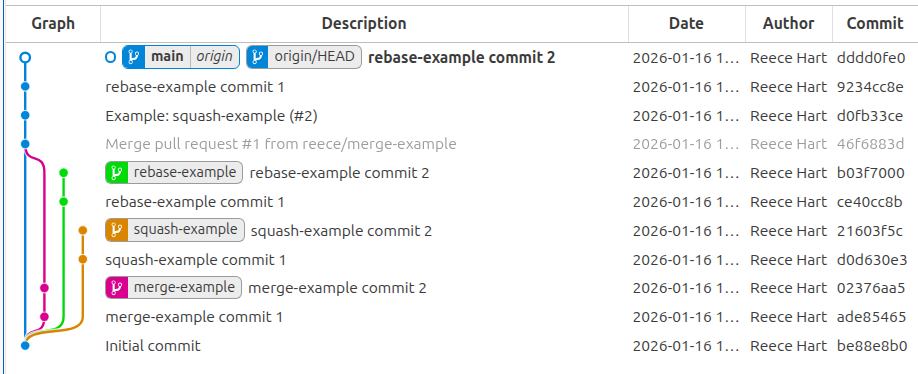

# merge-methods-demo

Demonstrates merge commit, squash merge, and rebase merge methods using an automated script for changes, and uses this to discuss pros and cons of each method.

## Generating the merge-test repo

    ./bin/github-merge-methods-setup.sh

Note: this will delete a local and remote repo called `merge-test` in your github account. You must have authenticated with `gh` already.

## Results

Running the above script results in this simple repo commit graph:

The -example branches remain even though they have been merged.

    » git branch -vv
    * main           4cdfffb [origin/main] rebase-example commit 2
    merge-example  408a938 [origin/merge-example: gone] merge-example commit 2
    rebase-example f74d2bb [origin/rebase-example: gone] rebase-example commit 2
    squash-example 0f4aa4c [origin/squash-example: gone] squash-example commit 2

    » git branch --merged
    * main
    merge-example

`git fetch --prune` does not clean up these local branches.

## Discussion

The biocommons community should stive for consistency and simplicity across projects, including consistent policies across all repos.  While we should trust developers' judgement by default, that value must also be weighed against the benefits and costs of unnecessary optionality.

Each merge method has pros and cons, some of which can be mitigated, as summarized below.

| Strategy | Commit History | Pros | Cons | Mitigation Strategies  | Used By |
|----------|----------------|------|------|------------------------|---------|
| **Merge Commit** | All commits + adds merge commit | Complete history, easy to revert entire feature, shows collaboration | Verbose history, harder to read if developer didn't clean up | Encourage/require squashing before review, use commit conventions, require meaningful commit messages | [Linux kernel](https://docs.kernel.org/maintainer/rebasing-and-merging.html), [Git](https://git-scm.com/docs/git-merge), [Rust](https://rustc-dev-guide.rust-lang.org/tests/ci.html) |
| **Squash Merge** | Single commit containing all changes | Clean linear history, easy to revert, clear feature boundaries | Leaves dangling local branches that can't be easily cleaned up, loses detailed history, harder to debug, no individual credit for collaborative efforts | Keep feature branches for reference, write detailed squash commit messages, link to PR for full history | [Kubernetes](https://www.kubernetes.dev/docs/guide/github-workflow/) |
| **Rebase Merge** | Linear history with individual commits | Clean history, preserves individual commits, easy to follow | Leaves dangling local branches that can't be easily cleaned up, rewrites history (dangerous if shared), conflicts per commit | Never rebase shared branches, communicate rebase plans, use feature flags for long-running work  | [Django](https://docs.djangoproject.com/en/dev/internals/contributing/writing-code/working-with-git/), [Rails](https://guides.rubyonrails.org/contributing_to_ruby_on_rails.html) |

As mentioned above, we should have only one merge method.  If that method is squash or rebase, we necessarily lose commit information and we are left with orphan local branches that are difficult to clean up. Furthermore, there is no workaround for these deficits.  On the other hand, merge commits provide the flexibility to squash if the developer desires it or the reviewer requires it.

These are the reasons that biocommons projects use merge commits and disables the other merge options.

## Appendix: How to Squash

See [How can I easily squash commits on a branch before submitting a PR?](https://biocommons.org/en/latest/contributing/coding-guidelines/#how-can-i-easily-squash-commits-on-a-branch-before-submitting-a-pr).
